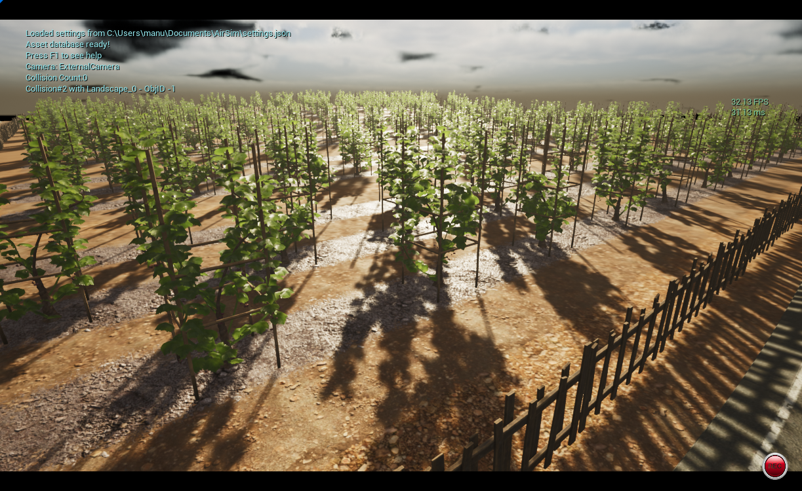

# AI Drone Swarm

Complete Installation - Colosseum with Unreal Engine 5.2 and AirSim Python API
=============================

Current System:
--------------
For optimal performance, consider a PC with higher specifications than the tested system.

Processor: Intel® Core™ i5-6400

Memory: 16 GB RAM

Graphics: NVIDIA® GeForce® GTX 1050ti

Since the project involves running three scripts concurrently, along with the AirSim simulation, it's advisable to have a more powerful PC to handle the increased CPU usage from these tasks. Additionally, a higher-performing system will help prevent slowdowns in the simulation caused by resource competition among the scripts.

`Note`: Before running the simulation go to `Edit->Editor Preferences` in Unreal Editor, in the `Search` box type `CPU` and ensure that `Use Less CPU when in Background` is unchecked. If you don't do this then UE will be slowed down dramatically when UE window loses focus.

Step 1: Install Unreal Engine 
----------------
Visit the Epic Games store and download `Unreal Engine 5.2`

`Note`: Colosseum requires Unreal Engine 5.0 or higher. Currently, it does not support Unreal Engine 5.3, nor 5.4

Step 2: Build Colosseum
----------------

* Install `Visual Studio 2022`. Make sure to select `Desktop Development with C++` and the latest version of `Windows 10 SDK`. Also, under 'Individual Components' tab, select the latest version of `.NET Framework SDK`.
* Launch Developer Command Prompt for VS 2022.
* Clone the repository: 
```
git clone https://github.com/CodexLabsLLC/Colosseum.git`
cd Colosseum.
```
* Execute `build.cmd` from the command line. This will create ready to use plugin bits in the `Colosseum/Unreal/Plugins` folder that can be dropped into any Unreal project.

Step 3: Creating and Setting Up Unreal Environment
---------------------

Follow the official documentation of AirSim [here](https://microsoft.github.io/AirSim/unreal_custenv/) for setting up the Unreal environment.

Step 4: Install Anaconda 
-----------------------

Visit the official Anaconda website [here](https://www.anaconda.com/) and download it.

Step 5: AirSim API
----------------------

Open `Anaconda Prompt` and install the following packages:
```
pip install msgpack-rpc-python
pip install airsim
```

Step 6: Run the simulation on Blocks Environment
------------

* Navigate to the Colosseum installation folder and open the Blocks Environment:
```
.../Colosseum/Unreal/Environments/Blocks/Blocks.uproject
```

* Once opened, run the simulation, you should see the drone spawning within the environment. Then, in the terminal, navigate to this directory:
```
.../Colosseum/PythonClient/multirotor
```

* Here, try executing the programs to ensure everything is working correctly. For instance, type:
```
python hello_drone.py
```

Project Setup
=============================

* Download our Unreal Environment, of the `Azienda Agricola Durin` wineyard ([GoogleMaps](https://www.google.com/maps/@44.055636,8.1158116,3a,75y,172.07h,69.68t/data=!3m7!1e1!3m5!1sD8AFsJmaAaPj43LZ06iMDw!2e0!6shttps:%2F%2Fstreetviewpixels-pa.googleapis.com%2Fv1%2Fthumbnail%3Fpanoid%3DD8AFsJmaAaPj43LZ06iMDw%26cb_client%3Dmaps_sv.tactile.gps%26w%3D203%26h%3D100%26yaw%3D89.79726%26pitch%3D0%26thumbfov%3D100!7i13312!8i6656?coh=205409&entry=ttu)) in `Ortovero (Albenga)`, by contacting us.

* Upon completion, navigate to the designated folder and open the settings.json file located at:
```
Documents/AirSim/settings.json
```

Within this file, insert the following configuration:
```
{
	"SeeDocsAt": "https://github.com/Microsoft/AirSim/blob/main/docs/settings.md",
	"SettingsVersion": 1.2,
	"SimMode": "Multirotor",
	"ClockSpeed": 1,	
	"Vehicles": {
		"Drone1": {
		  "VehicleType": "SimpleFlight",
		  "X": 3, "Y": 18, "Z": 0
		},
		"Drone2": {
		  "VehicleType": "SimpleFlight",
		  "X": 3, "Y": 25, "Z": 0
		},
		"Drone3": {
		  "VehicleType": "SimpleFlight",
		  "X": 3, "Y": 32, "Z": 0
		}
    }
}
```
`Note`: The (X,Y) coordinates are chosen wrt where the player start is placed: cell (0,0) in our case.

* Once you've opened our project in Unreal Engine and initiated the simulation, proceed to download our repository. Navigate to the `VR4R_Project` directory and execute the following command in the terminal:
```
python main.py
```

This will prompt three additional terminals to appear, each dedicated to a single drone. You'll observe them autonomously navigating within the environment.




