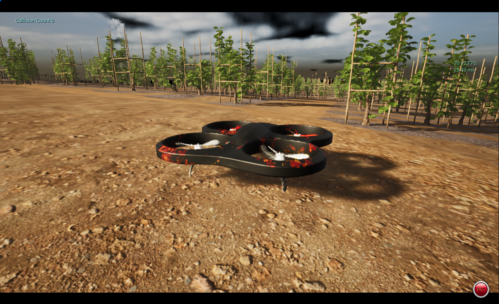
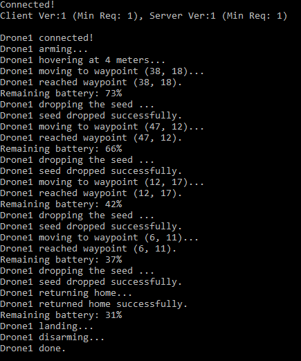

# Autonomous Drone Swarm Navigation

Project Description
==========================

In this project, we address the challenge of autonomous drone swarm navigation within a simulated environment in Unreal Engine, employing the A* algorithm for pathfinding. Our work is divided into several phases: 
* `Creating a Voxel Map`: Constructing a detailed 3D representation of the environment.
* `Extracting a 2.5D Map`: Simplifying the 3D map to a 2.5D map for efficient path planning.
* `Pathfinding`: Enabling drones to navigate the terrain between specified waypoints while considering various constraints.

The goal is to enable drones to move between specified waypoints while taking into account battery constraints, altitude and obstacles. This system has the potential to evolve and perform specific tasks, such as seeding (implemented) and monitoring plants conditions.



Complete Installation - Colosseum with Unreal Engine 5.2 and AirSim Python API
=============================

Current System:
--------------
For optimal performance, consider a PC with higher specifications than the tested system.

Processor: Intel® Core™ i5-6400

Memory: 16 GB RAM

Graphics: NVIDIA® GeForce® GTX 1050ti

Since the project involves running three scripts concurrently, along with the AirSim simulation, it's advisable to have a more powerful PC to handle the increased CPU usage from these tasks. Additionally, a higher-performing system will help prevent slowdowns in the simulation caused by resource competition among the scripts.

`Note`: Before running the simulation go to `Edit->Editor Preferences` in Unreal Editor, in the `Search` box type `CPU` and ensure that `Use Less CPU when in Background` is unchecked. If you don't do this then UE will be slowed down dramatically when UE window loses focus.

Step 1: Install Unreal Engine 
----------------
Visit the Epic Games store and download `Unreal Engine 5.2`

`Note`: Colosseum requires Unreal Engine 5.0 or higher. Currently, it does not support Unreal Engine 5.3, nor 5.4

Step 2: Install Visual Studio
------------------
To install Visual Studio 2022, follow these steps:

* Install `Visual Studio 2022` from the [official website](https://visualstudio.microsoft.com/it/vs/community/).
* Make sure to select `Desktop Development with C++` in the `Workloads` tab.
* In the installation details that appear after selecting `Desktop Development with C++` ensure you check the box for the latest version of the `Windows 10 SDK`.
* Then, go to the `Individual Components` tab and select the latest version of `.NET Framework SDK`.

Step 3: Build Colosseum
----------------
Launch Visual Studio 2022 and navigate to `Tools` > `Command Line` and select `Developer Command Prompt`. In the Developer Command Promt:

* Enter the following commands to clone the official Colosseum repository and navigate to the Colosseum directory: 
```
git clone https://github.com/CodexLabsLLC/Colosseum.git`
cd Colosseum.
```
* Execute the `build.cmd` script by typing the following command:
```
build.cmd
```
This command will create the plugin files in the `Colosseum/Unreal/Plugins` folder that can be dropped into any Unreal project.

Step 4: AirSim API
----------------------

Visit the official Anaconda website [here](https://www.anaconda.com/) and download it.

Search on Windows `Anaconda Prompt`, open it and install the following packages:
```
pip install msgpack-rpc-python
pip install airsim
```

Step 5: Test Everything in the Blocks Environment 
---------------

* Navigate to the installation folder of Colosseum and locate the `Blocks.uproject` file:
```
.../Colosseum/Unreal/Environments/Blocks/Blocks.uproject 
```
* Double-click `Blocks.uproject` to open it in Unreal Engine. This will launch Unreal Engine and load the Blocks environment.
* Once the Blocks environment is open in Unreal Engine, start the simulation. You should see a drone spawning within the environment.
* If this is not the case, double-click on `Blocks.sln` file instead of `Blocks.uproject` to open Visual Studio 2022. Make sure that Blocks project is set as the startup project, and that the build configuration is set to `DebugGame_Editor` and `Win64`. Then, press `F5` to run the project. Once opened, press the Play button in Unreal Editor to launch the simulation.
* Open the Anaconda Prompt and navigate to the directory containing the Python client for the Colosseum project:
```
.../Colosseum/PythonClient/multirotor
```
  * Execute the example programs to ensure everything is functioning correctly. For instance, run the following command:
```
python hello_drone.py
```

Project Setup
=============================

* Download our Unreal Environment, of the `Azienda Agricola Durin` wineyard ([GoogleMaps](https://www.google.com/maps/@44.055636,8.1158116,3a,75y,172.07h,69.68t/data=!3m7!1e1!3m5!1sD8AFsJmaAaPj43LZ06iMDw!2e0!6shttps:%2F%2Fstreetviewpixels-pa.googleapis.com%2Fv1%2Fthumbnail%3Fpanoid%3DD8AFsJmaAaPj43LZ06iMDw%26cb_client%3Dmaps_sv.tactile.gps%26w%3D203%26h%3D100%26yaw%3D89.79726%26pitch%3D0%26thumbfov%3D100!7i13312!8i6656?coh=205409&entry=ttu)) in `Ortovero (Albenga)`, by contacting us.

* Upon completion, navigate to the designated folder and open the `settings.json` file located at:
```
Documents/AirSim/settings.json
```

Within this file, insert the following configuration:
```
{
	"SeeDocsAt": "https://github.com/Microsoft/AirSim/blob/main/docs/settings.md",
	"SettingsVersion": 1.2,
	"SimMode": "Multirotor",
	"ClockSpeed": 1,
        "ViewMode": "",	
	"Vehicles": {
		"Drone1": {
		  "VehicleType": "SimpleFlight",
		  "X": 3, "Y": 18, "Z": 0
		},
		"Drone2": {
		  "VehicleType": "SimpleFlight",
		  "X": 3, "Y": 25, "Z": 0
		},
		"Drone3": {
		  "VehicleType": "SimpleFlight",
		  "X": 3, "Y": 32, "Z": 0
		}
    }
}
```
`Note1`: The (X,Y) coordinates are chosen wrt where the player start is placed: cell (0,0) in our case.

`Note2`: You can modify the `settings.json` to set the `ViewMode` to `Manual` if you wish to control the camera manually (by using WASD and arrows) during the simulaion. Otherwise, it will be fixed to follow Drone1. To do this, update the `ViewMode` setting as follows:
```
"ViewMode": "Manual"	
```

* Launch Unreal Engine and open your project. Start the simulation, and you will see a scene like this:
  

* Finally, download our `AI_DroneSwarm` repository. Then, navigate to the `VR4R_Project` directory in the Anaconda Prompt and execute the following command:
```
python main.py
```

Three new terminal windows will open, displaying the log for each drone. In the simulation, you will see the drones move concurrently within the environment, each following a mission defined by moving between waypoints.

`Note`: If you want to setup your own Unreal Engine project we leave you useful links to the AirSim documentation: https://microsoft.github.io/AirSim/unreal_custenv/

Simulation
===================

Watch a simulation where only Drone1 navigates through 4 waypoints (38, 18), (47, 12), (12, 17) and (6, 11), then returns to its starting position (3, 18):

https://github.com/manudelu/AI_DroneSwarm/assets/97695681/3fc44064-5587-4c31-8c8f-694dbee7b6e3

Here is the terminal window displaying the log for Drone1:




